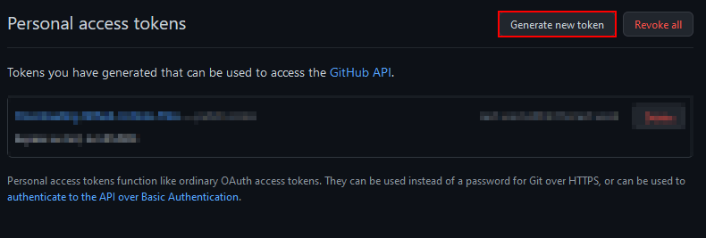
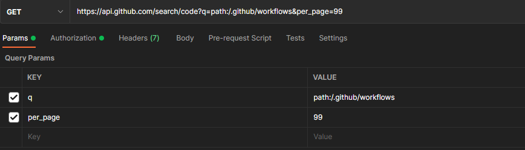
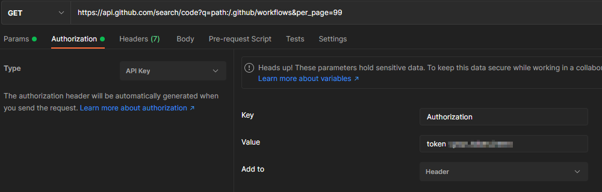

# StalkCD
This application has been developed as part of the master's thesis "Resilient Continuous Delivery Pipelines Based on BPMN" by Oliver Kabierschke.

More features where added by the study "Analysis and Integration of GitHub Actions into the StalkCD Ecosystem for Model-Based CI/CD Quality Assessment" by Clemens Kurz and Henning Möllers at the University of Hamburg.

# Notice
This document contains links to external sources.
We do and can not take responsibility for the content shown at external links.
The reader is advised to only click on links by their own judgement or not open a link at all.

## Prerequisites
To run the software, [Node.js](https://nodejs.org) is required as run-time environment. 

## Installation
In the directory of this repository, run the following command:

```shell
npm install
```

Now, compile the TypeScript code to JavaScript.

```shell
./node_modules/.bin/tsc
```

Or, if you have installed typescript globally (`npm -g i typescript`), just run:

```shell
tsc
```

## Execute Transformations
The application can be used to transform Jenkinsfiles to BPMN and back. You can get help on the usage of the tool by running `./stalkcd`.
For more detailed help, append '-h' to a command, e.g.: `./stalkcd jenkins2stalkcd -h`.

Some example commands:

```shell
./stalkcd jenkins2stalkcd -s ./Jenkinsfile -t ./Jenkinsfile.yml
./stalkcd stalkcd2bpmn -s ./Jenkinsfile.yml -t ./Jenkinsfile.bpmn
./stalkcd bpmn2stalkcd -s ./Jenkinsfile.bpmn -t ./Jenkinsfile.yml
./stalkcd stalkcd2jenkins -s ./Jenkinsfile.yml -t ./Jenkinsfile
```

## Download Sample Jenkinsfiles
The tool can download sample Jenkinsfiles from GitHub. During execution, it asks for your GitHub credentials, as the search API accross repositories is only accessible for logged-in users.

You have to provide a search expression. For example, to find all Jenkinsfiles written in the declarative syntax, you could use an expression like *'pipeline agent filename:Jenkinsfile in:file'*.

Example:

```shell
./stalkcd download-sample-jenkinsfiles -d ./res/Jenkinsfiles.source -q 'pipeline agent filename:Jenkinsfile in:file'
```

Note that the GitHub API only returns up to approx. 1000 search results. If you need more results, you can slightly vary the search expression and run the command multiple times. Already downloaded files will not be downloaded once again.

# Development
As development environment, we recommend using Visual Studio Code.

## Start continuous compilation
The typescript compiler supports automatically compiling the sources upon changes to the source files. Just run:

```bash
tsc -watch
```

# Run Tests in Docker
For the following steps the docker service needs to be provided. 
You can download it from the [official website](https://www.docker.com/products/docker-desktop/).

To run the tests for stalkcd in a controlled environment a dockerfile was created:
```
docker/Application.dockerfile
```
To create the image navigate to the root folder of this project and run the following command:
```bash
docker build --target stalkcd-application --tag stalkcd-application:latest --file docker/Application.dockerfile .
```
It composes the `docker/run.sh` and some more files to be able to run the app into the image.
Files/Folders which might change often are excluded like the `src` and the `res` folders.
`src` and `res` have to be provided as volumes. 
The test can be run with the following command:
```bash
docker run --rm -v "/absolute/path/to/folder/res:/usr/app/res" -v "/absolute/path/to/folder/src:/usr/app/src" stalkcd-application
```
Please provide the correct paths for the volumes on your local machine.

# Github-API-Token
If it becomes necessary to download a further bulk of files than already exist in the project, 
with Github-API-V3 it is necessary to get an Github-API-Token

It is possible to generate a token when logged in to Github: 
```
Settings > Developer Settings > Personal access tokens > Generate new token
```
When creating the token no scope is required.
After the token is created, it is only shown once.
It is therefore required to save it separately.



[//]: # (![Github token scope]&#40;images/github_scopePage.png&#41;)

The documentation about tokens is [here](https://docs.github.com/en/authentication/keeping-your-account-and-data-secure/creating-a-personal-access-token)
and about the rate limit [here](https://docs.github.com/en/rest/rate-limit).

After generating the Token it might be needed to test if the token actually works how expected.
There are some tools available which support making REST-Requests, notably is [curl](https://curl.se/download.html) and [Postman](https://www.postman.com/downloads/).

The following Screenshots are taken in Postman.
The first shows how the request is structured and the second how to do the authentication with the Github-API.

